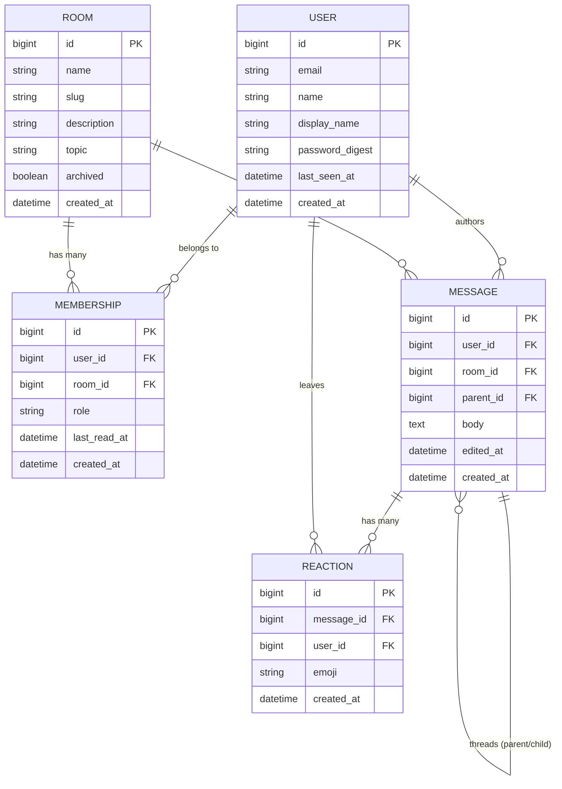
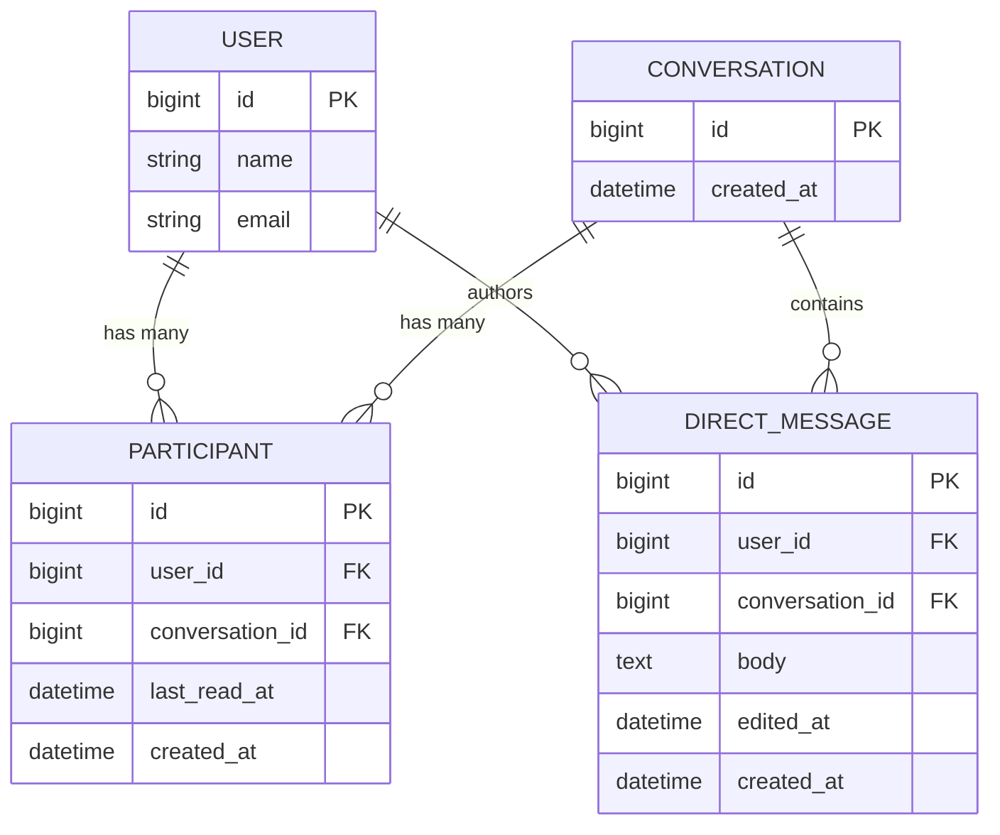

# Data Models

Proposed models for Hearth. Organized from core (MVP) to extended.

---

## Core Models

### Entity Relationship Diagram



---

## Direct Messages

DMs are modeled as Conversations (a private room between 2+ users) with their own messages.
Keeping them separate from room messages avoids polymorphic joins and makes authorization simpler.



---

## Model Notes

### User
- `password_digest` — works with Rails `has_secure_password` (bcrypt). If using Devise, this
  column is managed automatically.
- `last_seen_at` — updated on activity; used to derive online presence.
- Avatar handled by Active Storage (`has_one_attached :avatar`), not a DB column.

### Room
- `slug` — URL-friendly name (e.g. `#general` → `/rooms/general`). Unique, indexed.
- `archived` — soft-disable a room without deleting history.
- `topic` — the pinned topic line shown at the top of the room (like Slack's channel topic).

### Membership
- `role` — `member` or `admin`. Admins can archive rooms, remove members, etc.
- `last_read_at` — timestamp of when the user last read the room. Used to calculate unread
  message count without a separate reads table.

### Message
- `parent_id` — self-referential foreign key for threads. A message with `parent_id: nil` is a
  top-level message. Replies point to the parent. Keep threads shallow (one level) to start.
- `edited_at` — `nil` if never edited; set on edit. Displayed as "edited" in the UI.
- Body storage: plain text for v1. Add Action Text (`has_rich_text :body`) when rich formatting
  is needed.

### Reaction
- `emoji` — store the emoji character directly (e.g. `"👍"`), not a name. Simple and portable.
- Unique index on `[message_id, user_id, emoji]` — one reaction per user per emoji per message.

### Conversation / Participant
- A Conversation with 2 Participants is a DM. 3+ is a group DM.
- `last_read_at` on Participant mirrors the same pattern as Membership for unread counts.

---

## Indexes to Add

```ruby
# Memberships
add_index :memberships, [:user_id, :room_id], unique: true

# Messages
add_index :messages, [:room_id, :created_at]
add_index :messages, :parent_id

# Reactions
add_index :reactions, [:message_id, :user_id, :emoji], unique: true

# Rooms
add_index :rooms, :slug, unique: true

# Participants
add_index :participants, [:user_id, :conversation_id], unique: true

# Direct messages
add_index :direct_messages, [:conversation_id, :created_at]
```

---

## Future Models

| Model | Purpose |
|---|---|
| `Pin` | Pinned messages in a room |
| `Bookmark` | User-saved messages |
| `Notification` | In-app notification feed |
| `Mention` | Extracted `@user` references for notification routing |
| `InviteLink` | Shareable signup tokens |
| `Poll` / `PollVote` | In-channel polls |
